# Byurakan Astrophysical Observatory

A bilingual, theme-aware web presence for the [V. Ambartsumian Byurakan Astrophysical Observatory](https://hrant13k.github.io/Byurakan-Astrophysical-Observatory/) — one of the oldest centers of astrophysical research in the region, founded on Mount Aragats in 1946.

**Live:** [hrant13k.github.io/Byurakan-Astrophysical-Observatory](https://hrant13k.github.io/Byurakan-Astrophysical-Observatory/)

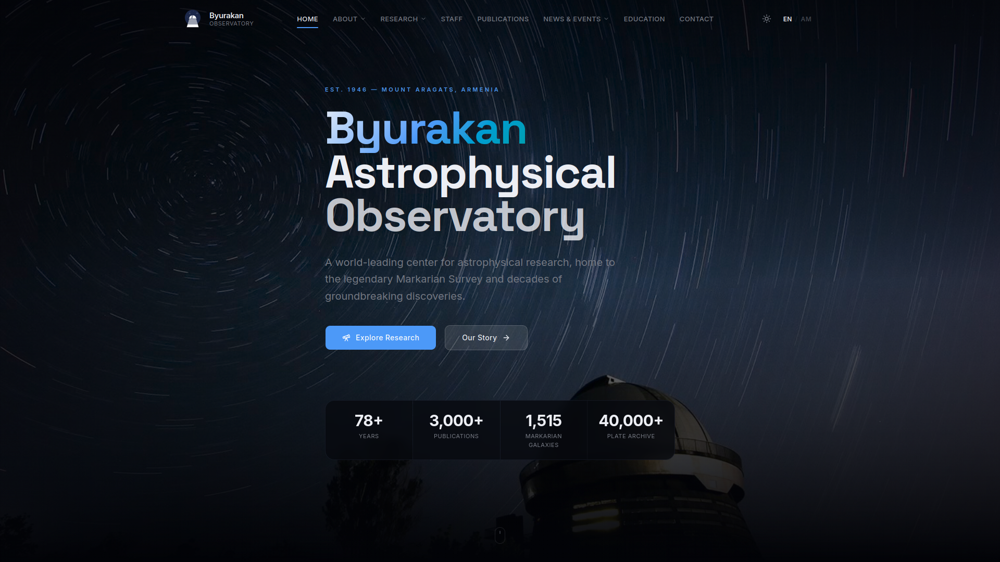

## About

The existing observatory website had not kept pace with the science happening inside it. This rebuild is a calm, scientific, fully bilingual site that treats Armenian and English as equal citizens of the interface, with first-class dark and light themes and an accessibility-first mobile experience.

| Before | After |
| --- | --- |
| 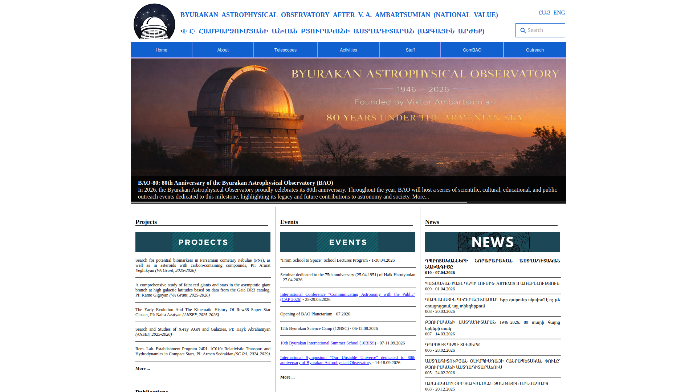 |  |

## Features

- **Full bilingual parity** — every string, staff name, publication author, and journal is localized (English / Հայերեն). Filter state survives a language switch.
- **Dark and light themes** — persisted per user, respects `prefers-color-scheme` on first visit, applied pre-hydration so there is no flash of the wrong theme.
- **Mobile-first responsive layout** — 44 px tap targets, Armenian-wrap-aware headings, a clean mobile sheet menu tuned from 320 px upward.
- **Accessible by default** — semantic landmarks, visible focus rings, `aria-expanded` submenus, keyboard-navigable theme and language switchers.
- **Content-driven architecture** — typed data modules for staff, research, publications, events, news, and education. No CMS required.
- **Static and fast** — fully prerendered at build time, deployable to any static host.

## Stack

- [Next.js 16](https://nextjs.org/) (App Router, static export)
- [React 19](https://react.dev/)
- [Tailwind CSS v4](https://tailwindcss.com/) with `oklch` theme tokens
- [shadcn](https://ui.shadcn.com/) components on top of [Base UI](https://base-ui.com/)
- [Framer Motion](https://www.framer.com/motion/) for entrance animations
- [Lucide](https://lucide.dev/) icons
- Custom React context for i18n and theming

## Screenshots

| Surface | Preview |
| --- | --- |
| Home · light · English | 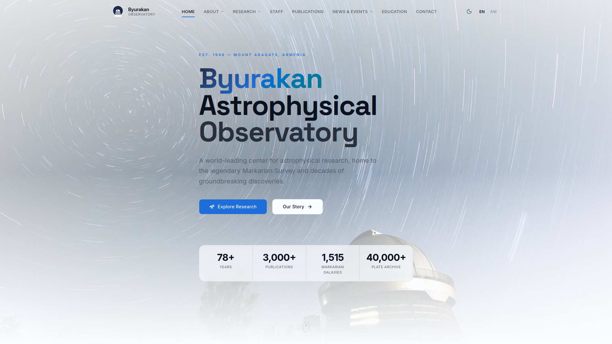 |
| Home · dark · Armenian | 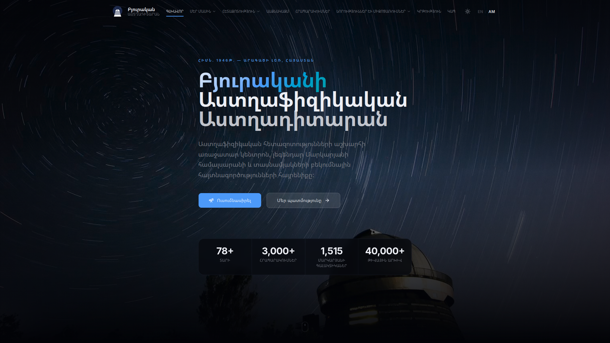 |
| About | 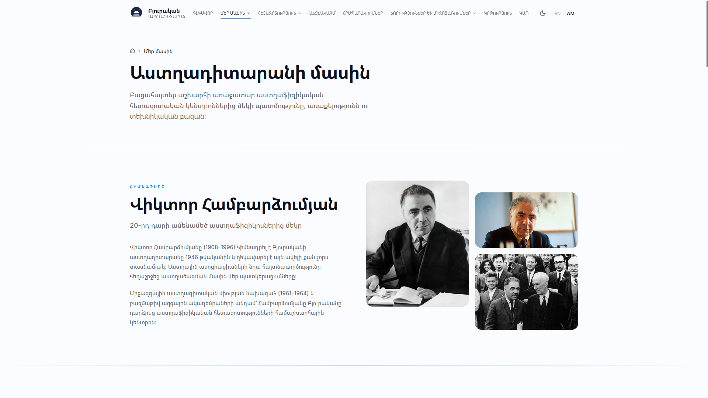 |
| Research | 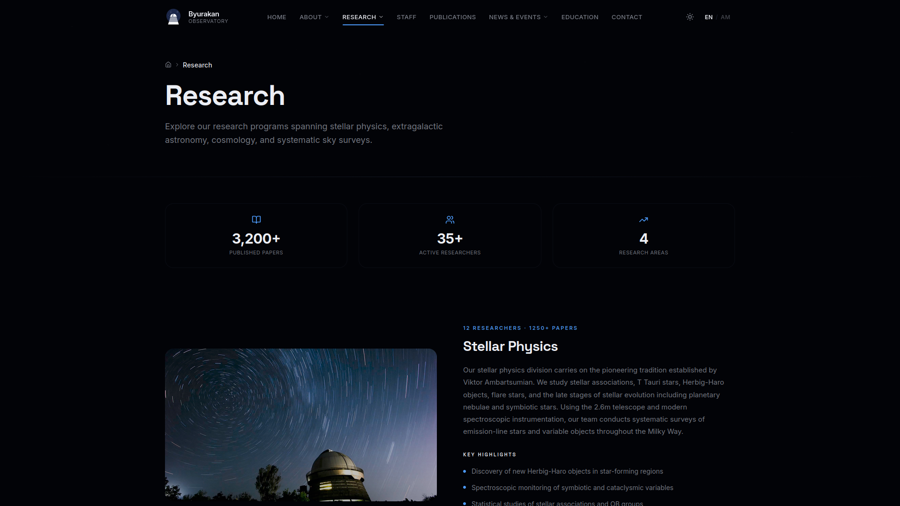 |
| Staff | 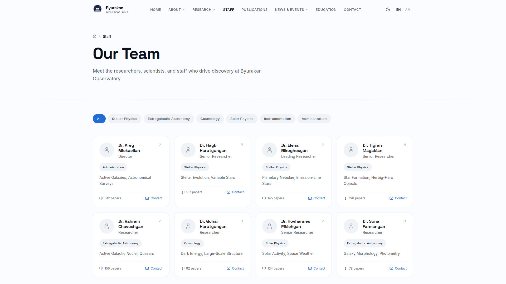 |
| Publications | 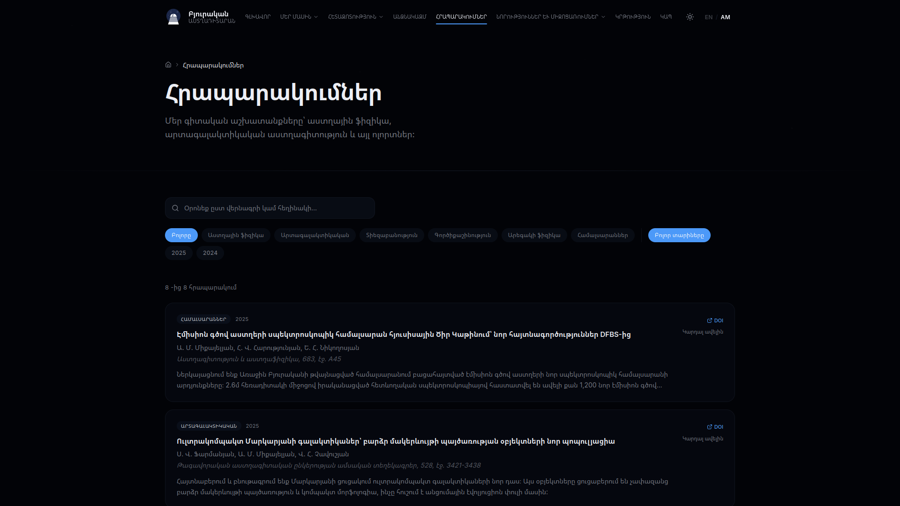 |
| News | 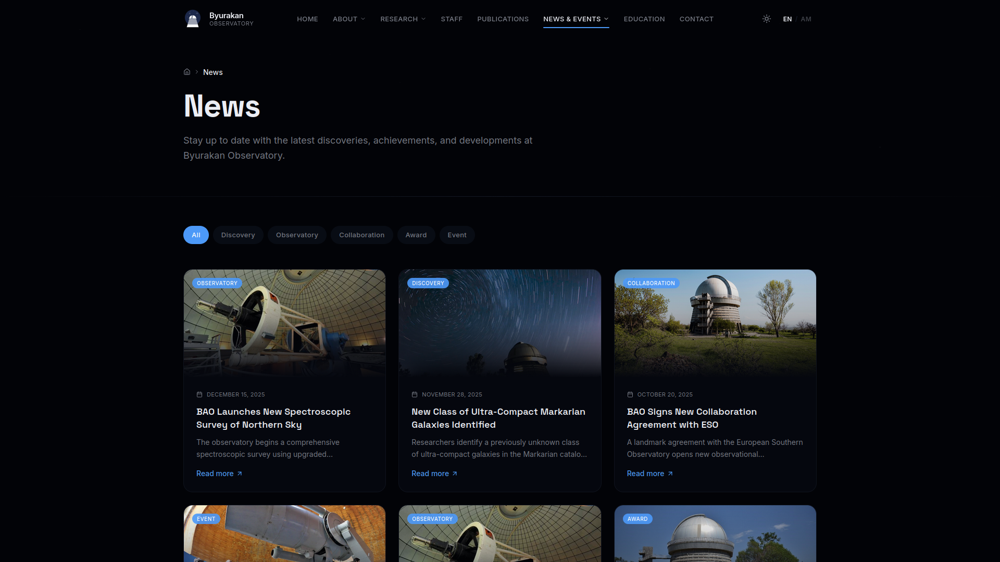 |
| Events | 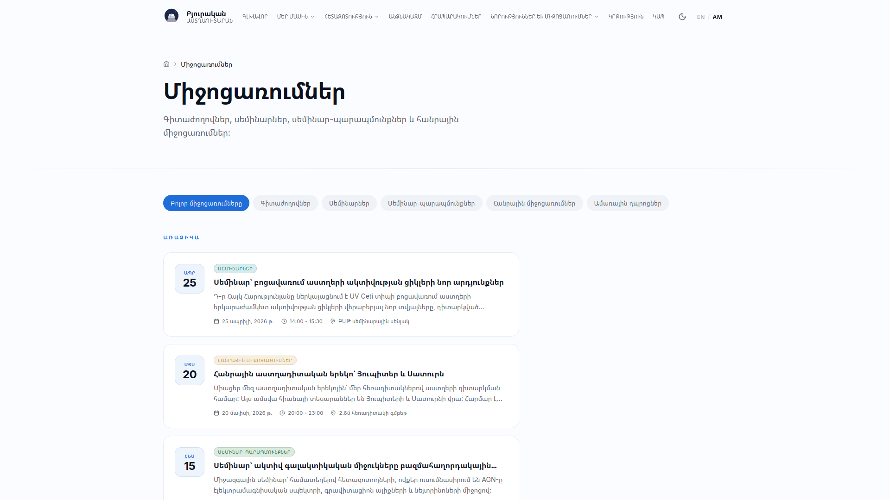 |
| Education | 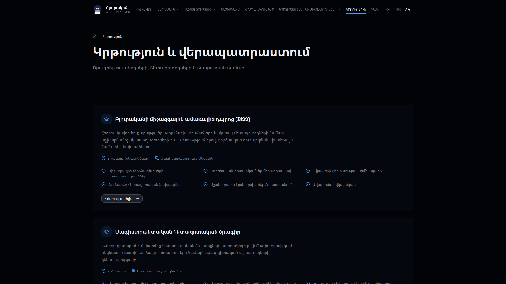 |
| Contact | 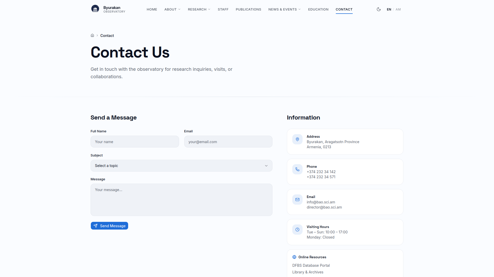 |

A full case study (PDF and individual page assets) lives in [`screenshots/`](screenshots/).

## Local development

The Next.js project lives in the `website/` subdirectory.

```bash
cd website
npm install
npm run dev
```

Open [http://localhost:3000](http://localhost:3000).

## Build

```bash
cd website
npm run build
```

The static export is written to `website/out/`.

## Deployment

The site deploys to GitHub Pages automatically on every push to `main` via [`.github/workflows/deploy.yml`](.github/workflows/deploy.yml). The workflow builds the static export and publishes `website/out/` to the `gh-pages` environment.

`next.config.ts` sets `basePath: "/Byurakan-Astrophysical-Observatory"` only in production so assets resolve correctly under the GitHub Pages path while local development stays at the root.

## Project structure

```
.
├── .github/workflows/deploy.yml   # GitHub Pages deploy
├── screenshots/                   # Case-study imagery
└── website/                       # Next.js app
    ├── public/                    # Static assets (images, icon)
    └── src/
        ├── app/                   # App Router routes
        ├── components/            # Shared components (cards, layout, UI)
        ├── data/                  # Typed content modules
        └── lib/
            ├── i18n/              # Language context + translations
            └── theme/             # Theme context + pre-hydration script
```

## License

[MIT](LICENSE)
